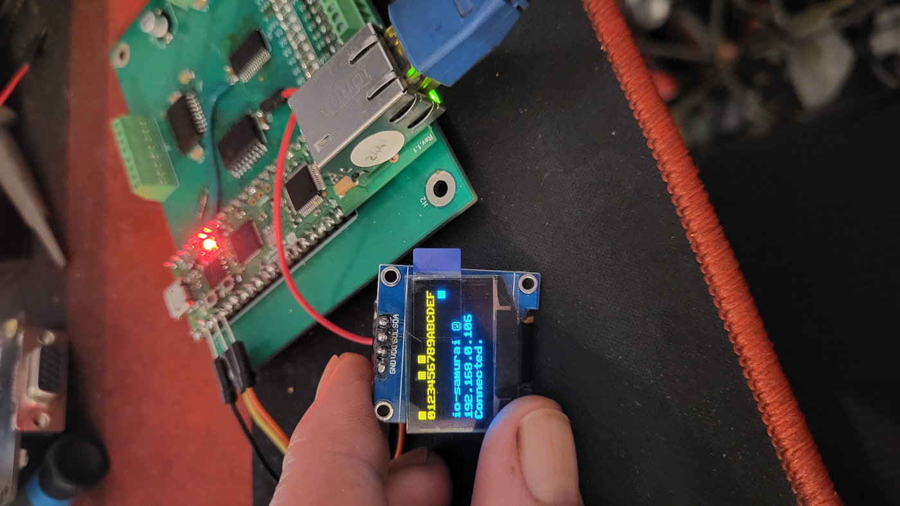

# io-samurai
An open-source, budget-friendly CNC Input Output interface for LinuxCNC, 16 inputs (20–50 V), 8 high-current outputs (50 V, 500 mA Max), and single analog input (0–3.3 V). Supports W5100S-EVB-Pico module. Further support W5500-lite + pico or pico2

## Features
- **High-Speed Interface**: W5100S-evb-pico Ethernet. https://docs.wiznet.io/Product/iEthernet/W5100S/w5100s-evb-pico
- **Inputs**: 16 channels (MCP23017, I2C), 20–50 V, with 10 kΩ/1.5 kΩ divider and 3.6 V Zener protection.
- **Outputs**: 8 channels (TD62783 Darlington driver, MCP23008-controlled), 50 V, 500 mA/channel.
- **Analog Inputs**: 1 channels (GP26), 12-bit, ~10 kΩ potentiometer, 100 nF filtering.
- **Display**: Optional SH1106 OLED (128x64) for I/O status and IP address (not required for operation).
- **Software**:
  - LinuxCNC HAL driver, with safety functions (timeout, data checks).
  - Python library for automation/remote I/O.
  - Further Mach3 driver development.
- **Hardware Support**: W5100S-EVB-Pico.
- **Open-Source**: All code, PCB production files, and docs under MIT License.

## Support
- **Notes**: If you want to buy ready to go io-samurai send message to me for options.
- **Patreon**: Join our community at [patreon](https://www.patreon.com/c/user?u=43314769).

## License
This project is licensed under the MIT License. See [LICENSE](LICENSE).
The `ioLibrary_Driver` in `firmware/pico/ioLibrary_Driver.zip` is licensed under the MIT License by Wiznet. See [firmware/pico/ioLibrary_Driver.zip/LICENSE.txt](firmware/pico/ioLibrary_Driver.zip/LICENSE.txt).
